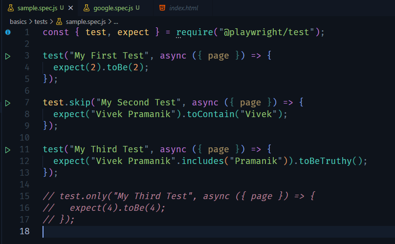
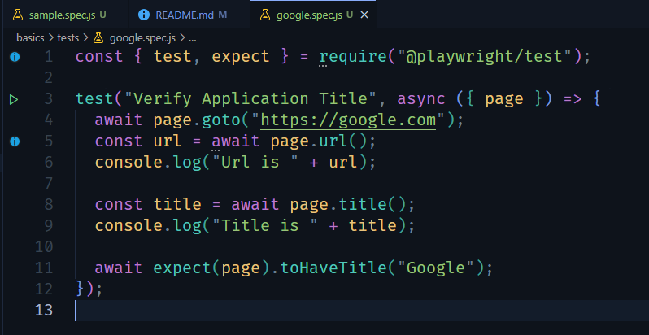
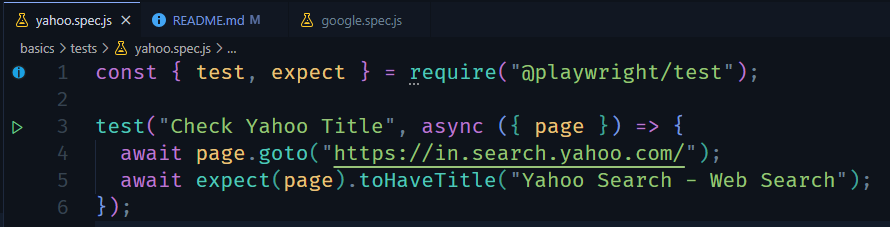

## Learning PLayright

1. How To Install Playwright ?

    Command: <code>npm init playwright@latest</code>

2. Basic Syntax to write TestCases with Assertion

    
     
    
     
    

3. If we have multiple testcases JS files and if we want to specifically run a test file, then we'll type the below mentioned comment:

    Command: <code>npx playwright test tests/searchanother.spec.js  --headed</code>

    We can use the <code>--headed</code> flag to run the tests in headlist mode instead in headed mode